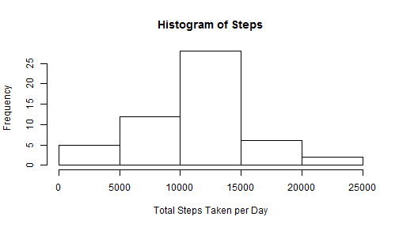
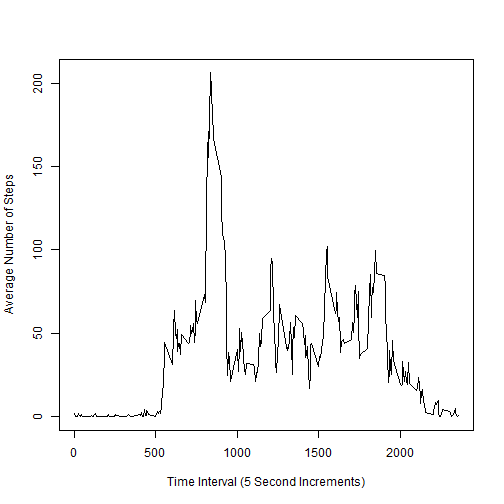
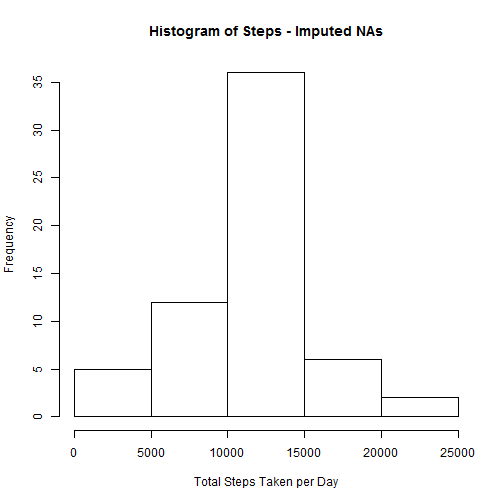
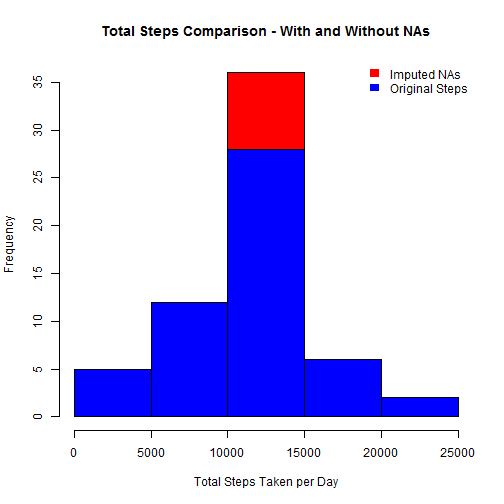
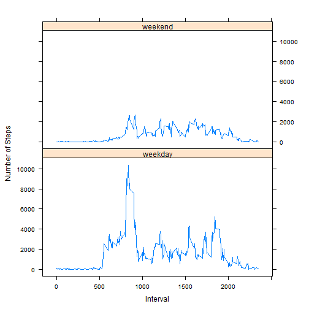

---
title: "Reproducible Research: Peer Assessment 1"
output: 
  html_document:
    keep_md: true
---  

# Loading and preprocessing the data

```r
activity <- read.csv("activity.csv",stringsAsFactors=FALSE)  
```

# What is mean total number of steps taken per day?

```r
totalStepsPerDay <- aggregate(steps ~ date, data = activity, sum)  
```

### Make a histogram of the total number of steps taken each day

```r
hist(totalStepsPerDay$steps, main="Histogram of Steps", xlab="Total Steps Taken per Day")  
```

 
### Calculate and report the Mean and Median of the total number number of steps taken per day

```r
originalMean <- mean(totalStepsPerDay$steps)  
originalMedian <- median(totalStepsPerDay$steps)  
```

```
## Mean:  10766.1886792453
## Median:  10765
```
# What is the average daily activity pattern?
### Calculate the mean number of steps per 5 minute interval

```r
meanStepsPerInterval <- aggregate(steps ~ interval, data = activity, mean)  
```

### Make a time series plot of the 5-minute interval and the average number of steps taken

```r
library(datasets)  
data(meanStepsPerInterval)  
with(meanStepsPerInterval, plot(interval, steps, type="l", 
ylab="Average Number of Steps", xlab="Time Interval (5 Second Increments)"))  
```

 
### Which 5-minute interval contains the maximum number of steps

```r
maxSteps <- which(meanStepsPerInterval == max(meanStepsPerInterval$steps),arr.ind=TRUE)  
maxStepsInterval <- meanStepsPerInterval[maxSteps[1],1]  
```

```
## The 5 minute interval with the maximum number of steps:  835
```
# Imputing missing values
### Calculate and report the total number of missing values in the dataset 

```r
rowsWithNAs <- length(which(is.na(activity)))  
```

```
## Total Number of rows missing values:  2304
```
### Devise a strategy for filling in NA values in the dataset

```
## Strategy for filling in missing values:  replace NAs with the mean steps for that 5 minute time interval
```
### Create a new activity dataset with NAs replaced with the mean steps for that interval

```r
justNAs <- activity[is.na(activity$steps),]  # file of only NAs  
justNoNAs <- activity[!is.na(activity$steps),]  # file of everything else  
justMerge <- merge(justNAs, meanStepsPerInterval, by = "interval")  # plug in values for NAs  
inputedNAs <- subset(justMerge, select=c(steps.y,date,interval))  
colnames(inputedNAs) <- c("steps", "date", "interval")  
joinedActivity <- rbind(justNoNAs, inputedNAs)  
activityImputedNAs <- joinedActivity[order(joinedActivity$date,joinedActivity$interval),]  
```
### Make a histogram of the total number of steps taken each day 

```r
totalStepsPerDayImputedNAs <- aggregate(steps ~ date, data = activityImputedNAs, sum)  
hist(totalStepsPerDayImputedNAs$steps, main="Histogram of Steps - Imputed NAs",
     xlab="Total Steps Taken per Day")  
```

 
### Report the Mean and Median total number of steps taken per day

```r
imputedNAsMean <- mean(totalStepsPerDayImputedNAs$steps)  
imputedNAsMedian <- median(totalStepsPerDayImputedNAs$steps)  
```

```
## Mean total number of steps per day with Imputed NAs:  10766.1886792453
## Median total number of steps per day with Imputed NAs:  10766.1886792453
```
### Do these values differ from the estimates from the first part?

```r
hist(totalStepsPerDayImputedNAs$steps, main="Total Steps Comparison - With and Without NAs", 
  xlab="Total Steps Taken per Day", col="red")  
hist(totalStepsPerDay$steps, add=T, col="blue")  
legend('topright', c("Imputed NAs", "Original Steps"), fill = c("red", "blue"), bty = 'n', border = NA)  
```

 
# Are there differences in activity patterns between weekdays and weekends?

```r
activityImputedNAs$date <- as.Date(activityImputedNAs$date, "%Y-%m-%d")  
weekEnd <- c("Saturday", "Sunday")  
activityImputedNAs$day <- ifelse(weekdays(activityImputedNAs$date) %in% weekEnd, "weekend", "weekday")  
totalStepsWkdayWkend <- aggregate(steps ~ interval+day, data = activityImputedNAs, sum)  
```
### Make a panel plot containing a time series plot (i.e. type = "l") of the 5-minute interval (x-axis) and the average number of steps taken, averaged across all weekday days or weekend days (y-axis)

```r
library(lattice)  
library(datasets)  
totalStepsWkdayWkend <- transform(totalStepsWkdayWkend, day = factor(day))  
xyplot(steps ~ interval | day, 
       type = "l", 
       xlab="Interval",
       ylab="Number of Steps",
       data = totalStepsWkdayWkend, 
       layout = c(1,2))  
```

 
